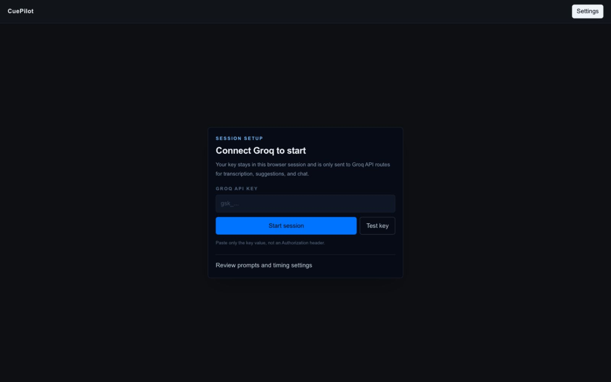
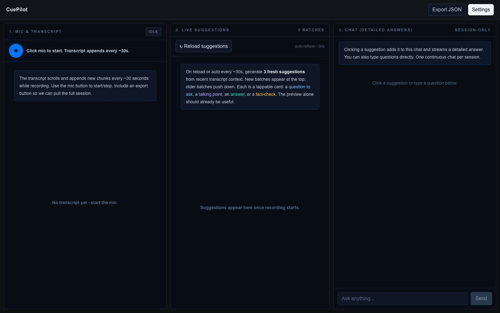

# CuePilot

CuePilot is a real-time meeting copilot built with Next.js and Groq. It records microphone audio in the browser, transcribes complete audio segments with Whisper, surfaces exactly 3 context-aware live suggestions, and streams grounded follow-up answers in chat.

## Live Links

- Production: [https://twinmind-assignment-iota.vercel.app/](https://twinmind-assignment-iota.vercel.app/)
- Repository: [https://github.com/Avinash987/twinmind-assignment](https://github.com/Avinash987/twinmind-assignment)
- Architecture: [docs/ARCHITECTURE.md](./docs/ARCHITECTURE.md)

## What It Does

- Captures live mic audio with rotating complete media segments
- Transcribes sequentially with Groq `whisper-large-v3`
- Generates exactly 3 non-repeating live suggestion cards with Groq `openai/gpt-oss-120b`
- Streams expanded answers for clicked cards and typed chat questions
- Exposes prompts, timing, context windows, and audio gating in-app
- Exports transcript, suggestion batches, chat history, timestamps, and settings as JSON

## System Overview

```mermaid
flowchart LR
    Mic["Microphone"] --> Recorder["Browser recorder rotation"]
    Recorder --> Queue["FIFO audio queue"]
    Queue --> Transcribe["/api/transcribe"]
    Transcribe --> Whisper["Groq Whisper Large V3"]
    Whisper --> Transcript["Transcript reducer state"]
    Transcript --> Suggest["/api/suggestions"]
    Suggest --> SuggestModel["Groq GPT-OSS 120B"]
    SuggestModel --> Cards["3 live suggestion cards"]
    Transcript --> Chat["/api/chat"]
    Cards --> Chat
    Chat --> ChatModel["Groq GPT-OSS 120B"]
    ChatModel --> Stream["SSE chat stream"]
    Stream --> UI["Chat panel"]
    Transcript --> Export["Session export JSON"]
    Cards --> Export
    UI --> Export
    Settings["sessionStorage + localStorage"] --> Recorder
    Settings --> Suggest
    Settings --> Chat
```



## Screenshots

### First-run setup



### Main workspace



## Why This Build Is Interesting

The hard part is not calling a model. The hard part is making the loop stable enough that the output is usable during a real conversation:

- browser audio has to be chunked into files Whisper can actually decode
- transcript updates have to stay ordered
- suggestion refreshes need cadence control and repetition control
- clicked answers need more context than live cards without turning into long reports
- structured suggestion output has to survive model formatting drift

## Product Flow

1. The browser records mic audio as complete rotating `MediaRecorder` segments.
2. The default transcript and suggestion cadence is roughly 30 seconds, with lower values still available in Settings for demos.
3. Each completed segment enters a FIFO transcription queue.
4. The app transcribes one segment at a time and appends only non-empty transcript chunks.
5. The suggestion scheduler checks whether enough time has passed and whether new transcript exists.
6. `/api/suggestions` receives recent transcript, the latest chunk, prior batches, and the editable live prompt.
7. The model returns exactly 3 validated suggestion cards, which render as the newest batch at the top.
8. Clicking a card or sending a typed chat question calls `/api/chat`.
9. The chat route streams deltas back to the UI over Server-Sent Events.
10. Export builds a single JSON artifact from in-memory session state and excludes the Groq API key.

## Prompt Strategy

The live suggestion prompt is optimized for timing, usefulness, and variety rather than summary quality. It asks the model to silently infer the current conversation mode, then choose the right mix of cards for that moment:

- `SETUP`: establish agenda, stakeholders, goals, and constraints
- `DISCOVERY`: uncover missing inputs, compare options, answer active questions
- `TRADEOFF`: pressure-test costs, risks, assumptions, and decision criteria
- `HANDOFF`: convert the discussion into owners, next steps, deadlines, and unresolved risks

Available card types:

- answer
- question to ask
- talking point
- fact-check
- clarification
- risk
- next step

Grounding rules:

- live suggestions use the most recent 10 minutes of transcript, capped to 4,500 characters
- the latest chunk is passed separately so the model weights what was just said
- previous batches are passed back in so the model avoids repeating the same idea
- noisy ASR, partial sentences, and repeated chunks are treated as lower-confidence context
- unsupported external facts should be phrased as something to verify, not presented as certainty

Clicked answers use a wider transcript window by default, 25 minutes capped to 10,000 characters. They follow a fixed structure:

1. `Context`
2. `Key points`
3. `You could say`

That keeps the chat panel skimmable and directly usable during the meeting.

## Stack

- Next.js App Router
- React + TypeScript
- Tailwind CSS
- Browser-only session state with `useReducer`
- Groq OpenAI-compatible APIs
  - Transcription: `whisper-large-v3`
  - Suggestions and chat: `openai/gpt-oss-120b`

## Runtime and Storage

- No login
- No database
- No transcript persistence across reloads
- Groq API key stored in `sessionStorage`
- Prompt and numeric settings stored in `localStorage`
- Transcript, suggestions, and chat kept in memory for the current session only

## Local Development

```bash
npm install
npm run dev
```

Open [http://localhost:3000](http://localhost:3000), paste a Groq API key, allow mic access, and start a session.

## Validation

```bash
npm run lint
npm run build
```

## Tradeoffs

- Suggestions are non-streaming so the UI only renders complete validated JSON batches.
- Chat streams because perceived latency matters more there than atomic rendering.
- The app uses time-windowed transcript grounding rather than a rolling summary to keep context recent and easier to reason about.
- The recorder rotates complete media files instead of uploading raw timeslice fragments because fragmented browser WebM output is less reliable for Whisper.
