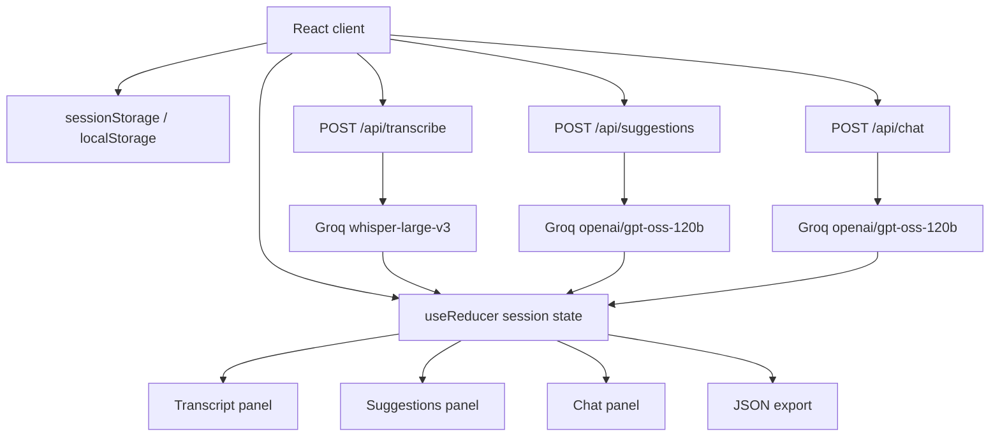

# Architecture

CuePilot is a session-only meeting copilot. The browser owns all live state, while Next.js API routes proxy Groq requests so the UI can use a user-provided Groq key without shipping any hard-coded secret.

## Topology



## Runtime Flow

1. `AppShell` loads local prompt/timing settings and the session Groq key.
2. If no key exists, `ApiKeyGate` blocks the app with a focused key setup screen.
3. When the mic starts, the browser opens one `MediaStream` and rotates complete `MediaRecorder` segments.
4. Each completed audio segment is pushed into a FIFO queue.
5. The queue transcribes one segment at a time through `/api/transcribe`.
6. Transcript chunks append to reducer state and auto-scroll in the transcript panel.
7. The suggestion scheduler checks whether enough new transcript and time have passed.
8. `/api/suggestions` receives recent transcript, latest chunk, prior batches, and the editable live prompt.
9. Each suggestion batch renders at the top of the middle column.
10. Clicking a card or typing a question calls `/api/chat`, which streams deltas back to the chat panel.
11. Export builds one JSON file from the current in-memory state, excluding the Groq key.

## State Model

`useReducer` is the single state owner. The important state groups are:

- `status`: mic/transcript/suggestions/chat work states for inline panel feedback.
- `transcriptChunks`: timestamped Whisper outputs with stable ids.
- `suggestionBatches`: immutable batches of exactly 3 suggestions.
- `chatMessages`: one continuous session chat, including clicked-card metadata.
- `settings`: prompt, timing, context, and audio controls.
- `errors`: recent panel-scoped errors shown near the relevant UI.

The API key is stored in `sessionStorage`. Prompt and numeric settings are stored in `localStorage`. No transcript, suggestions, or chat history persist across reloads.

## Audio Capture

The app does not upload raw `MediaRecorder.start(timeslice)` fragments. Some browsers emit WebM fragments that Whisper cannot decode independently, which causes "valid media file" errors. Instead, `AppShell` starts a recorder, stops it after the configured segment duration, uploads that complete segment, then starts a new recorder on the same mic stream.

The lightweight voice gate samples RMS amplitude every 250ms. Segments with too little speech-like signal are skipped locally unless the user manually refreshed. This keeps pauses, silent chunks, and background noise from interrupting the session.

## Transcription

`/api/transcribe` receives a browser `Blob`, rebuilds a clean `FormData`, sets `whisper-large-v3`, and forwards it to Groq. The client appends only non-empty transcripts. Malformed or tiny audio chunks are treated as recoverable live-session noise.

## Live Suggestions

Suggestions are non-streaming by design. The UI should render only a validated batch, not partial JSON.

The prompt receives:

- recent transcript window, capped by time and characters
- latest chunk separately, so the model prioritizes what was just said
- recent prior suggestions, so it avoids repeating the same idea
- a strict JSON schema requiring exactly 3 cards

The route also validates types, urgency, confidence, and transcript ids before returning the batch. Unknown `sourceTranscriptIds` are replaced with the latest available chunk id so exported grounding stays valid.

## Chat

`/api/chat` uses the clicked-answer prompt for suggestion clicks and the chat prompt for typed questions. It forwards Groq's stream as browser-friendly Server-Sent Events. The client reducer appends each delta to a placeholder assistant message, so the answer appears immediately while still belonging to the same session chat.

Clicked-card answers use a larger transcript context than live suggestions because the user explicitly asked for detail. The default structure is `Context`, `Key points`, and `You could say`.

## Prompt Settings

The default prompt strategy is exposed in Settings because prompt behavior is a core product surface. The defaults are tuned for:

- timely cards over summaries
- phase-aware suggestion mix
- useful previews that stand alone
- cautious handling of unsupported facts and noisy ASR
- concise clicked-card answers that can be skimmed during a live conversation

## Timing Model

- Transcript segments default to `30000ms`
- Suggestion refreshes default to `30000ms`
- Manual reload flushes the active recorder segment before asking for a fresh batch
- Lower cadences remain available in Settings for demos and tuning, but the shipped defaults stay aligned with the assignment behavior

## Module Map

- `src/components/AppShell.tsx`: orchestration for mic, recorder rotation, queueing, suggestions, chat, settings, and export.
- `src/components/*Panel.tsx`: presentational panels for transcript, suggestions, and chat.
- `src/components/SettingsModal.tsx`: editable prompt, context, timing, and audio controls.
- `src/components/ApiKeyGate.tsx`: first-run Groq key setup.
- `src/app/api/transcribe/route.ts`: Groq Whisper proxy.
- `src/app/api/suggestions/route.ts`: structured suggestion generation and validation.
- `src/app/api/chat/route.ts`: streamed chat/expanded-answer proxy.
- `src/lib/prompts.ts`: default prompts.
- `src/lib/defaults.ts`: model ids, storage keys, and default settings.
- `src/lib/transcript.ts`: transcript windowing and prompt formatting.
- `src/lib/groq.ts`: Groq request helpers and key normalization.
- `src/lib/reducer.ts`: session state reducer.
- `src/lib/exportSession.ts`: evaluator JSON export.

## Validation

Before submitting or deploying:

```bash
npm run lint
npm run build
```
